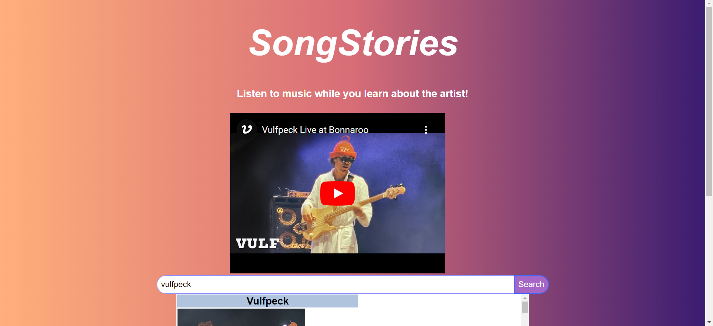
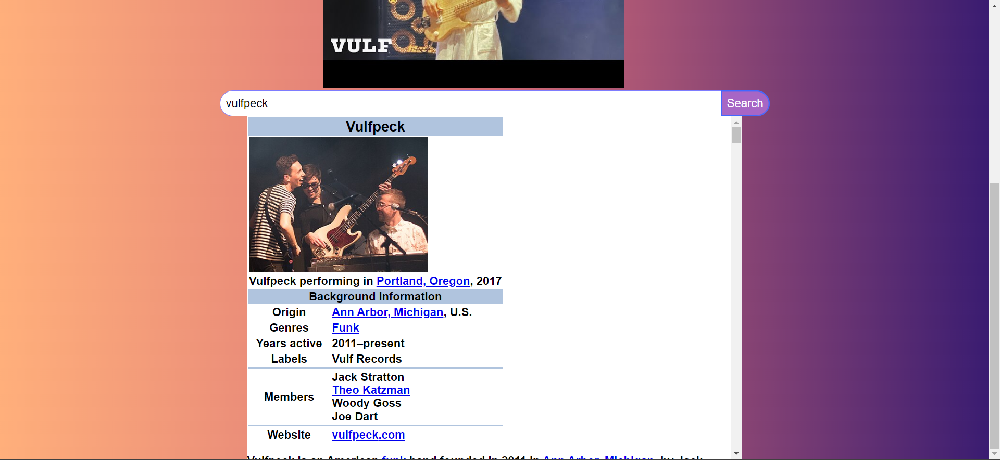

# Project-One (SongStories)

## Description
Our project--SongStories-- seeks to inform individuals about an artist before or while we listen to them. A music artist could have been groundbreaking in their genre, but how would we know prior? Understanding an artist's background may enhance our enjoyment of them and enrich our experience. SongStories utilizes both the Wikipedia and Youtube server-side APIs to achieve this effect. Effectively, this allows us to pull up information regarding a song/artist and listen while we learn. The creation of this project helped us learn the utilizations of server-side APIs in an application, as well as wielding a polished CSS frameworks.

## Installation
To use this application, one must navigate to the webpage and simply begin searching.

## Usage
First use this link: https://sivelos1.github.io/Song-Stories/. Then, go to the search bar and enter an artist or song of your choice. The example here is the funk band Vulfpeck.

Once you type and hit enter, both a scrollable Wikipedia page and a playable Youtube video should appear! The video is seen above the search bar.

The Wikipedia page is below.

Have fun exploring your favorite artist or finding something new!

## Credits
Collaborators:
Devin Amlen(https://github.com/Sivelos1)

Neil Holloway(https://github.com/SporeSun)

Joseph Spinosi(https://github.com/brosephspinosi)

Server-Side APIs:
YouTube: https://www.youtube.com/player_api
Wikipedia:https://www.mediawiki.org/wiki/API:Main_page

CSS Framework:
Blaze UI:https://www.blazeui.com/

Third Party Application:
ChatGPT

## License:
MIT License
Copyright (c) 2012-2023 Scott Chacon and others

Permission is hereby granted, free of charge, to any person obtaining
a copy of this software and associated documentation files (the
"Software"), to deal in the Software without restriction, including
without limitation the rights to use, copy, modify, merge, publish,
distribute, sublicense, and/or sell copies of the Software, and to
permit persons to whom the Software is furnished to do so, subject to
the following conditions:

The above copyright notice and this permission notice shall be
included in all copies or substantial portions of the Software.

THE SOFTWARE IS PROVIDED "AS IS", WITHOUT WARRANTY OF ANY KIND,
EXPRESS OR IMPLIED, INCLUDING BUT NOT LIMITED TO THE WARRANTIES OF
MERCHANTABILITY, FITNESS FOR A PARTICULAR PURPOSE AND
NONINFRINGEMENT. IN NO EVENT SHALL THE AUTHORS OR COPYRIGHT HOLDERS BE
LIABLE FOR ANY CLAIM, DAMAGES OR OTHER LIABILITY, WHETHER IN AN ACTION
OF CONTRACT, TORT OR OTHERWISE, ARISING FROM, OUT OF OR IN CONNECTION
WITH THE SOFTWARE OR THE USE OR OTHER DEALINGS IN THE SOFTWARE.

